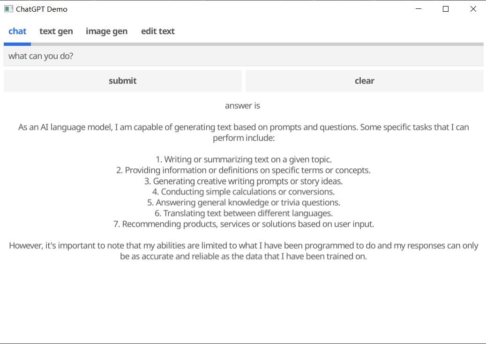
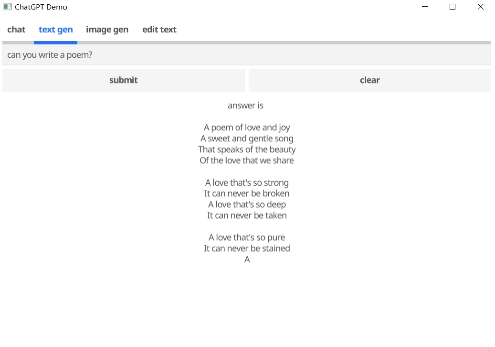
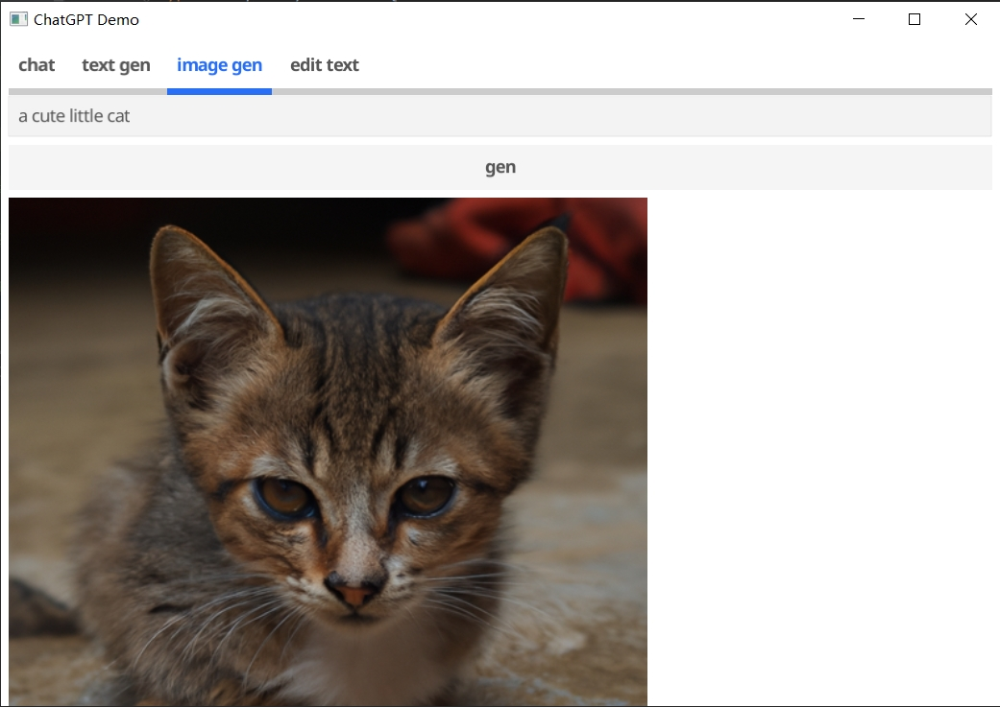
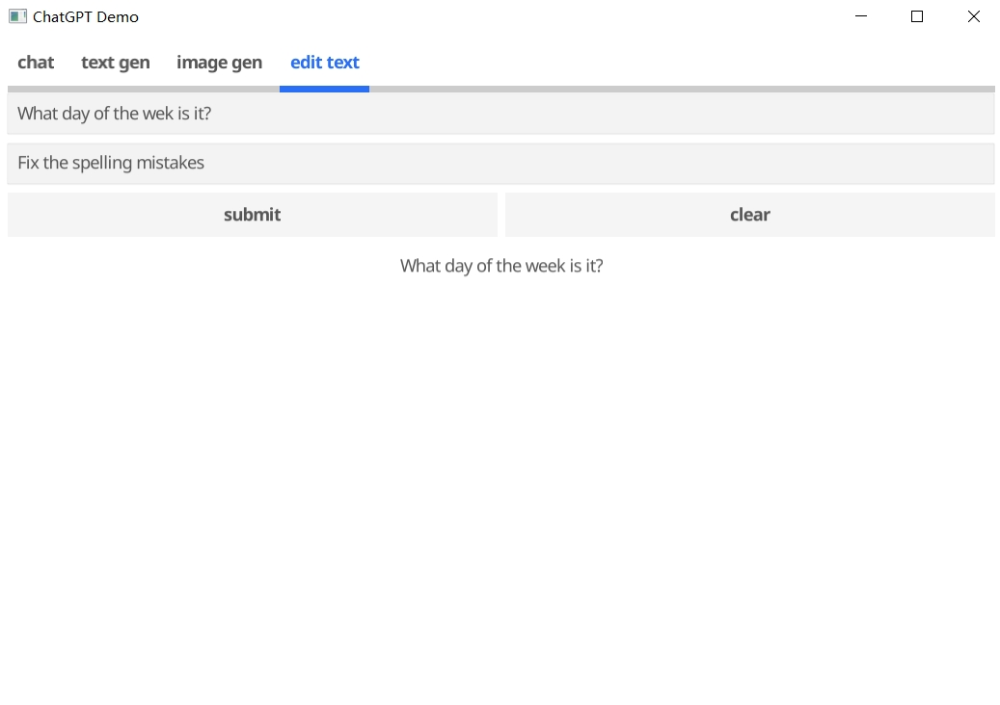

## OpenAI接口的可视化界面展示
本项目用Golang实现对[OpenAI](https://platform.openai.com/docs/api-reference/introduction) 提供的接口实现一个展示界面，用Golang生成可视化界面并调用接口。具体调用的接口有[聊天(chat)](https://platform.openai.com/docs/api-reference/chat) ，
[文本完善(completions)](https://platform.openai.com/docs/api-reference/completions) ，
[生成图片](https://platform.openai.com/docs/api-reference/images) 和
[编辑文本(edits)](https://platform.openai.com/docs/api-reference/edits)  
### 界面展示
#### 聊天

在输入框输入聊天的内容，点击提交和chatgpt交互，点击clear清空数据。结果展示到下面的标签上
#### 文本完善

操作和聊天相同
#### 图片生成

在输入框输入生成图片的描述，在下面展示出生成的图片
#### 编辑

第一个输入框是输入文本，第二个输入框是对文本的操作（如图）
### 参数配置
将API的参数放到了config文件夹的*_config.yaml文件里面。例如edit_config.yaml就保存了edits接口所使用的参数，如果
需要可以根据自己的需求对参数进行更改。 
用户的key保存在key.yaml文件中，执行的时候需要换成自己key。

### 运行
在config/key.yaml文件里将key改为自己的。然后运行最外层的main.go文件即可。

